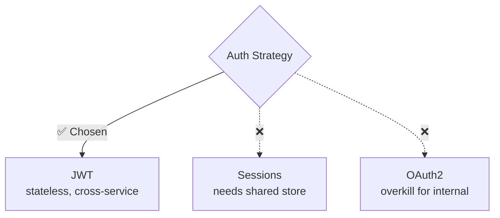

# Why Log

Record AI decision-making alongside code changes. Captures reasoning, alternatives, and trade-offs in per-change markdown documents — fully automatic, no manual triggers needed.

[한국어 README](README.ko.md)

## Why

AI-assisted code changes lose their reasoning context. PR reviewers see **what** changed but not **why**. Developers lose context between sessions. This plugin solves that by automatically recording decision logs in `docs/decisions/` — versioned alongside your code.

## Installation

### Claude Code

Run the following commands inside Claude Code:
```
/plugin marketplace add suMin77123/why-log-marketplace
/plugin install why-log@why-log-marketplace
```

### Cursor

```
/add-plugin why-log
```

Or clone the repo and point Cursor to the `.cursor-plugin/` directory.

### Gemini CLI

```bash
gemini extensions install https://github.com/suMin77123/why-log
```

### Codex

```bash
git clone https://github.com/suMin77123/why-log.git ~/.codex/why-log
mkdir -p ~/.agents/skills
ln -s ~/.codex/why-log/skills ~/.agents/skills/why-log
```

See [Codex installation guide](.codex/INSTALL.md) for details.

## How It Works

### Automatic (Zero User Intervention)

The plugin operates fully automatically through 4 stages:

**1. Session Start** — Hook injects a reminder with the count of existing decision logs.

**2. Decision Detection** — When the AI detects a significant decision point, it logs immediately without asking:

```
Decision logged: docs/decisions/2026-03-30-auth-strategy-jwt.md
```

Trigger signals:
- Architecture choices (JWT vs sessions)
- Library/dependency selection (Prisma vs TypeORM)
- Approach selection during brainstorming
- Plan approval or modification
- Plan modifications during planning
- Bug root cause analysis
- Performance/security judgments
- Implementation deviation from plan
- Implementation branch points
- Trade-off resolutions
- Refactoring decisions

**3. Commit** — Decision logs are NOT auto-staged. The AI asks you before including `docs/decisions/*.md` in a commit, so you can keep your codebase clean while still capturing reasoning.

**4. PR Creation** — When the AI creates a PR, it automatically collects decision logs (both committed and local) and includes a **Why Log** section in the PR body with full inline content and a mermaid diagram:

```markdown
## Why Log

### Auth Strategy: JWT
**Decision:** Use JWT tokens with httpOnly cookie storage.
**Alternatives:** Session-based (simple but needs shared store), OAuth2 (standard but overkill)
**Reasoning:** JWT allows stateless verification across microservices without shared session store.
**Trade-offs:** Token revocation requires additional infrastructure (acceptable for MVP).


```

### Manual (Backup)

| Command | Purpose |
|---------|---------|
| `/why-log [topic]` | Log a decision the AI didn't catch |
| `/why-pr [base-branch]` | Create a PR with decision summaries when not using the AI flow |

## Decision Log Format

Each decision is stored as `docs/decisions/YYYY-MM-DD-<topic>.md`:

```markdown
# Authentication Strategy: JWT vs Sessions

**Date:** 2026-03-30
**Status:** Accepted
**Scope:** src/auth/, src/middleware/

## Context
The app needs user authentication for API endpoints.
We're building a microservices architecture where multiple
services need to verify user identity independently.

## Decision
Use JWT tokens with httpOnly cookie storage.

## Alternatives Considered

### Session-based Auth
- **Pros:** Simple, built-in revocation
- **Cons:** Requires shared session store across services

### OAuth2 Only
- **Pros:** Delegated auth, industry standard
- **Cons:** Overkill for internal service-to-service auth

## Reasoning
JWT allows stateless verification across microservices without
a shared session store. The trade-off of complex token revocation
is acceptable given our low-risk profile.

## Trade-offs Accepted
- Token revocation requires additional infrastructure (acceptable for MVP)
- Larger request payload than session cookies (negligible impact)

## Related Code Paths
- `src/auth/jwt-handler.ts` - Token creation and verification
- `src/middleware/auth.ts` - Request authentication middleware

## Consequences
- Must implement token refresh mechanism before v2
- All new services can verify auth independently
```

## Noise Prevention

The skill only logs decisions that meet ALL criteria:
1. **2+ viable alternatives** were genuinely considered
2. **Future reader value** — someone would benefit from understanding the reasoning
3. **Non-obvious** — the reasoning cannot be inferred from the code alone

## Workflow Example

```
1. Start session
   -> Hook: "Decision logging active, 3 existing logs"

2. Brainstorm auth approaches with AI
   -> AI presents JWT vs sessions vs OAuth
   -> You choose JWT
   -> AI records decision (or defers if in plan mode)

3. Plan the implementation
   -> You modify plan: "Use refresh tokens instead of short-lived only"
   -> AI records plan modification decision (deferred to plan file)

4. Exit planning, start coding
   -> AI flushes deferred decisions to docs/decisions/*.md
   -> "Decision logged: docs/decisions/2026-03-30-auth-strategy-jwt.md (deferred from planning phase)"

5. During implementation, deviate from plan
   -> "Using httpOnly cookies instead of localStorage"
   -> AI updates the existing decision log with implementation change

6. Commit code
   -> AI asks: "Include decision logs in this commit? (y/n)"
   -> Your choice: commit them with code, or keep them local

7. Create PR
   -> AI auto-includes Why Log section with full decision content + mermaid diagram
   -> Works even if decision files were not committed
   -> Reviewer sees the full decision journey: request → plan → changes → result
```

## Hook Setup

### Session Start Reminder
Installed automatically with the plugin. Shows a reminder at session start with the count of existing decision logs.

## How It Differs from Brainstorming

If you use [superpowers](https://github.com/obra/superpowers) brainstorming, you might wonder: why add another plugin?

They solve different problems:

| | Brainstorming | Why Log |
|---|---|---|
| **When** | Before coding — designing what to build | Throughout — from initial request to final result |
| **Output** | Design spec (`docs/superpowers/specs/`) | Decision logs (`docs/decisions/`) |
| **Trigger** | You explicitly start it | Fully automatic — detects and logs on its own |
| **Audience** | You and your team, planning | PR reviewers and your future self |
| **Captures** | The design process | The reasoning behind choices |

**In practice, they work together:**

1. Brainstorm "How should we build auth?" → you choose JWT over sessions → **why-log records it**
2. Plan the implementation → you modify the plan → **why-log records the change**
3. Start implementing → deviate from plan → **why-log updates the decision log**
4. Complete the work → **why-log records the outcome**
5. Create PR → decision summaries with full journey appear in the PR body

Brainstorming is a *design process*. Why Log captures *the reasoning behind every choice* — from the initial request through planning, implementation, and final result.

## Compatibility

- Works alongside the [superpowers](https://github.com/obra/superpowers) plugin
- Integrates with brainstorming, plan mode, and TDD workflows
- Cross-platform: Claude Code, Cursor, Codex, Gemini CLI

## License

MIT
