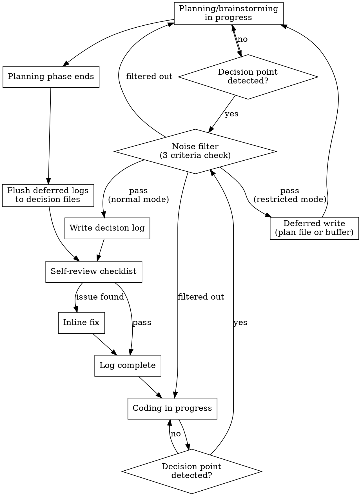

# Decision Logging

Record significant decisions alongside code changes so future readers understand **WHY**, not just **WHAT**.

**Announce at start:** "I'm using the why-log skill to record this decision."

## Key Principles

1. **Why > What** — Code shows what; logs show why
2. **Signal > Noise** — What you DON'T log matters more than what you do
3. **Inline > Separate** — Decisions belong in the same commit as the code
4. **Compact PR, Detailed Log** — PR gets a one-line summary; full reasoning lives in the log file
5. **Auto > Manual** — Default behavior requires zero user intervention
6. **Reversible** — Every decision can be Superseded or Deprecated later

<HARD-GATE>
When a HIGH priority decision is detected (architecture, library selection, approach selection,
plan modification, bug root cause, performance/security judgment), the decision MUST be recorded
BEFORE proceeding. In normal mode, write the decision log file immediately. In restricted mode
(e.g., plan mode where only the plan file is editable), use Deferred Logging.
Do not continue without recording the decision.
</HARD-GATE>

## Process Flow



## Core Principle

If a future PR reviewer or your future self would ask "why did you do it this way?", log the decision.

## When to Log

**Log when ALL of these are true:**
1. Two or more viable alternatives were genuinely considered
2. The choice has consequences a future reader would want to understand
3. The reasoning is not obvious from the code itself

**Do NOT log:**
- Trivial choices (naming, formatting, obvious patterns)
- Decisions already captured in an existing log for this change
- Choices dictated by constraints with no real alternatives
- Mechanical implementation details

## Trigger Signals

| Signal | Example | Priority |
|--------|---------|----------|
| Architecture choice | "JWT vs sessions — let's go with JWT" | HIGH |
| Library/dependency selection | "Prisma vs TypeORM" | HIGH |
| Approach selection during brainstorming | "Let's go with approach A over B" | HIGH |
| Plan approval or modification | Design confirmed after brainstorming | HIGH |
| Plan modification | "Change the plan from X to Y because..." | HIGH |
| Bug root cause analysis | "Root cause is X, fixing with approach Y" | HIGH |
| Performance/security judgment | "Add index vs caching vs query optimization" | HIGH |
| Implementation deviation from plan | "Plan said X but implementing Y instead" | MEDIUM |
| Implementation branch point | "Using Strategy pattern here" | MEDIUM |
| Trade-off resolution | "Prioritize readability over performance" | MEDIUM |
| Refactoring decision | "Splitting this module because..." | MEDIUM |

## The Process

### Step 1: Identify the Decision

When you recognize a decision point from the trigger signals above, pause and assess significance using the three criteria (2+ alternatives, future reader value, non-obvious reasoning).

### Step 2: Create the Decision Log

**Do NOT ask for confirmation.** When a decision meets the criteria, log it immediately.

Create `docs/decisions/` directory if it does not exist.

Create a file at `docs/decisions/YYYY-MM-DD-<topic-slug>.md` using the template below.

**File naming rules:**
- Date: today's date in `YYYY-MM-DD` format
- Topic slug: lowercase, hyphenated, 3-6 words describing the decision
- If a file with the same name exists, append `-2`, `-3`, etc.
- Examples: `2026-03-30-auth-strategy-jwt-vs-session.md`, `2026-03-30-database-orm-selection.md`

### Step 3: Self-Review

After writing the log, run this checklist **inline** (no separate review pass):

1. **Title:** Does it describe a single decision? (If 2+ decisions, split into separate logs)
2. **Alternatives:** Are the listed alternatives genuinely viable? (Remove straw-man options)
3. **Reasoning:** Does it specifically reference trade-offs? (Not vague "it seemed better")
4. **Code Paths:** Do the paths in Related Code Paths actually exist?
5. **Consequences:** Are they realistic and actionable?

Fix any issues inline and move on. Do not re-review after fixing.

### Step 4: Report

After writing, briefly notify the user:

```
Decision logged: docs/decisions/YYYY-MM-DD-<topic>.md
```

Do not ask for review or approval. The user can read the log later if they want.

## Decision Log Template

Use this exact template for every decision log:

```markdown
# [Decision Title]

**Date:** YYYY-MM-DD
**Status:** Accepted
**Scope:** [Which part of the codebase this affects]

## Context

[2-4 sentences. What situation required a decision? What constraints existed?]

## Decision

[1-2 sentences stating the choice clearly.]

## Alternatives Considered

### [Alternative A Name]
- **Description:** [What this option would look like]
- **Pros:** [Bullet list]
- **Cons:** [Bullet list]

### [Alternative B Name]
- **Description:** [What this option would look like]
- **Pros:** [Bullet list]
- **Cons:** [Bullet list]

## Reasoning

[2-4 sentences explaining WHY the chosen option was selected over alternatives. Reference specific trade-offs.]

## Trade-offs Accepted

- [Trade-off 1: what we gave up and why it's acceptable]
- [Trade-off 2: ...]

## Related Code Paths

- `path/to/affected/file.ts` - [Brief description of how this file is affected]
- `path/to/other/file.ts` - [Brief description]

## Consequences

- [What this decision means for future development]
- [Any follow-up work this creates]
- [Constraints this imposes on future decisions]

## Decision Journey

> Include this section when the decision evolved through planning/brainstorming phases.
> Omit for simple implementation-time decisions.

### Initial Request
[What the user wanted and why this work started]

### Plan Evolution
- [Plan change 1]: [Why it changed]
- [Plan change 2]: [Why it changed]

### Implementation Changes
- [Change from plan during implementation]: [Why]

### Outcome
[Final result and how it differs from the original request, if at all]
```

**Status values:**
- `Accepted` — current active decision
- `Superseded by [filename]` — replaced by a newer decision
- `Deprecated` — no longer applicable

## Anti-Pattern: Do NOT Log These

- Variable/function naming choices (naming is not a decision)
- Code formatting or style preferences
- Patterns forced by the framework (no real choice existed)
- "Decisions" with only one viable alternative (that's inevitability, not choice)
- Anything already documented in CLAUDE.md, .cursorrules, or project conventions

## Split vs Merge Decisions

**Split into separate logs when:**
- They affect different areas of the codebase
- They can be independently reversed
- Different stakeholders care about different decisions

**Merge into one log when:**
- They're cascading decisions from the same context
- Changing one necessarily changes the other
- They affect the same code paths

## Session Limit

**Maximum 5 decision logs per session.** After the 5th, consolidate further decisions into the most relevant existing log as "Additional Decisions" sub-sections instead of creating new files.

## Consolidating Related Decisions

If multiple related decisions arise in one session, or when the session limit is reached, merge them into ONE log file:

1. Use the most significant decision as the title
2. Add sub-sections for related decisions:

```markdown
## Additional Decisions

### [Sub-decision Title]
**Decision:** [Brief statement]
**Reasoning:** [1-2 sentences]
```

## Disabling Logging

If the user says "stop logging", "no more logs", `/why-log off`, or similar, **immediately stop** creating decision logs for the rest of the session. Do not ask for confirmation — just stop and acknowledge:

```
Decision logging paused for this session.
```

To re-enable, the user can say "resume logging" or `/why-log on`.

## Auto-Staging on Commit

When committing code changes, **always** stage decision logs alongside the code they document:

```bash
git add docs/decisions/*.md
```

Run this before every `git commit` that accompanies code changes. No pre-commit hook is needed — just include the `git add` as part of your normal commit workflow. Decision logs are part of the change, not an afterthought.

## Auto PR Inclusion

When creating a pull request with `gh pr create`, **automatically** include decision logs in the PR body. Do not wait for the user to ask or use a separate command. Follow these steps:

1. **Check for decision logs on the current branch:**
   ```bash
   git diff --name-only $(git merge-base HEAD main)..HEAD -- docs/decisions/
   ```
2. **If decision logs exist**, read each file and append a `## Why Log` section to the PR body with a **compact bullet list** (not full details):
   ```markdown
   ## Why Log

   - **[Decision Title]**: [1-sentence decision summary]
     → [`docs/decisions/YYYY-MM-DD-topic.md`](docs/decisions/YYYY-MM-DD-topic.md)
   - **[Decision Title]**: [1-sentence decision summary]
     → [`docs/decisions/YYYY-MM-DD-topic.md`](docs/decisions/YYYY-MM-DD-topic.md)

   > Full reasoning and alternatives in each linked decision log.
   ```
3. **If no decision logs exist**, do not add the section — just create the PR normally.

**Important:** The PR summary is intentionally brief. Full context (alternatives, trade-offs, consequences) lives in the linked decision log files. Reviewers who want details click through; everyone else gets a quick overview.

This happens every time a PR is created, with no extra user action required.

## Deferred Logging

Some environments restrict file creation during planning phases (e.g., plan mode only allows editing the plan file). When a decision is detected but you cannot create `docs/decisions/*.md` files:

### Step 1: Record in available location

Write a `## Pending Decision Logs` section at the bottom of whichever file you CAN edit (plan file, scratch buffer, or conversation notes):

```markdown
## Pending Decision Logs

### [Decision Title]
- **Initial Request:** [What the user asked for and background]
- **Alternatives:** A vs B vs C
- **Decision:** A
- **Reasoning:** [Brief rationale]
- **Plan Changes:** [Any plan modifications related to this decision]
- **Scope:** [Affected area of codebase]
```

### Step 2: Flush after restrictions lift

As soon as file creation becomes available (e.g., after exiting plan mode, before writing any implementation code):

1. Read all `## Pending Decision Logs` entries
2. Convert each entry into a full `docs/decisions/YYYY-MM-DD-<topic>.md` file using the standard template
3. Include the Decision Journey section with Initial Request and Plan Evolution filled in
4. Remove the `## Pending Decision Logs` section from the source file
5. Notify the user: `Decision logged: docs/decisions/YYYY-MM-DD-<topic>.md (deferred from planning phase)`

### Step 3: Continue updating through implementation

As implementation progresses, update existing decision logs with:
- **Implementation Changes** entries in Decision Journey (if deviating from plan)
- **Outcome** section in Decision Journey (when the work is complete)

## Integration with Other Workflows

**With brainstorming:** Decisions happen throughout brainstorming, not just at the end. Log when:
- The user selects an approach from proposed alternatives (e.g., "Let's go with approach A")
- The user modifies or rejects a proposed design section
- The final design is approved with specific trade-offs
- If file creation is restricted during brainstorming, use Deferred Logging.

**With plan mode:** Decisions embedded in plan creation and modification are prime candidates for logging. Since plan mode typically restricts file creation, use Deferred Logging to capture decisions in the plan file and flush them when plan mode ends.

**With TDD:** Implementation decisions during TDD (e.g., choosing test strategy) are loggable if they represent meaningful alternatives.

**With commits:** Decision logs should be committed alongside the code they document. Always run `git add docs/decisions/*.md` before committing.

**With PRs:** Decision logs are automatically summarized in the PR body whenever `gh pr create` is used. No separate command is needed. The `/why-pr` command exists only as a manual fallback for creating PRs outside the AI-assisted workflow.

## Updating Existing Decisions

When a new decision supersedes an old one:
1. Update the old log's status to `Superseded by [new-filename]`
2. Reference the old log in the new log's Context section

## Common Mistakes

| Mistake | Fix |
|---------|-----|
| Over-logging every small choice | Apply the 2-alternatives + impact test |
| Vague reasoning ("it seemed better") | State specific trade-offs and constraints |
| Missing code paths | Always include Related Code Paths with actual file paths |
| Asking for confirmation before logging | Never ask — detect and log immediately, then notify |
| Forgetting to stage decision logs | Always `git add docs/decisions/*.md` before committing |
| Forgetting decision logs in PRs | Always check for and include decision logs when creating PRs |
| Stale logs left as "Accepted" | Update status when superseded |
